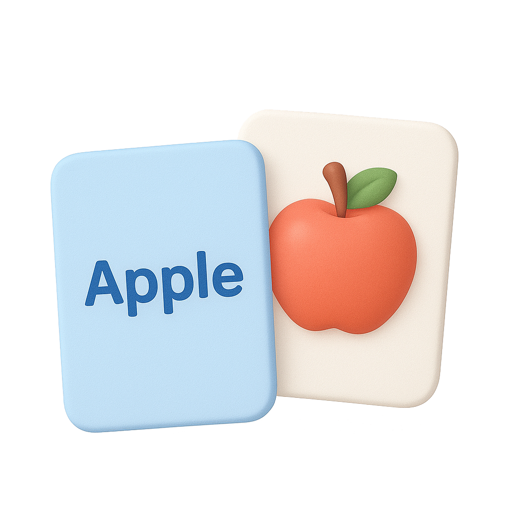
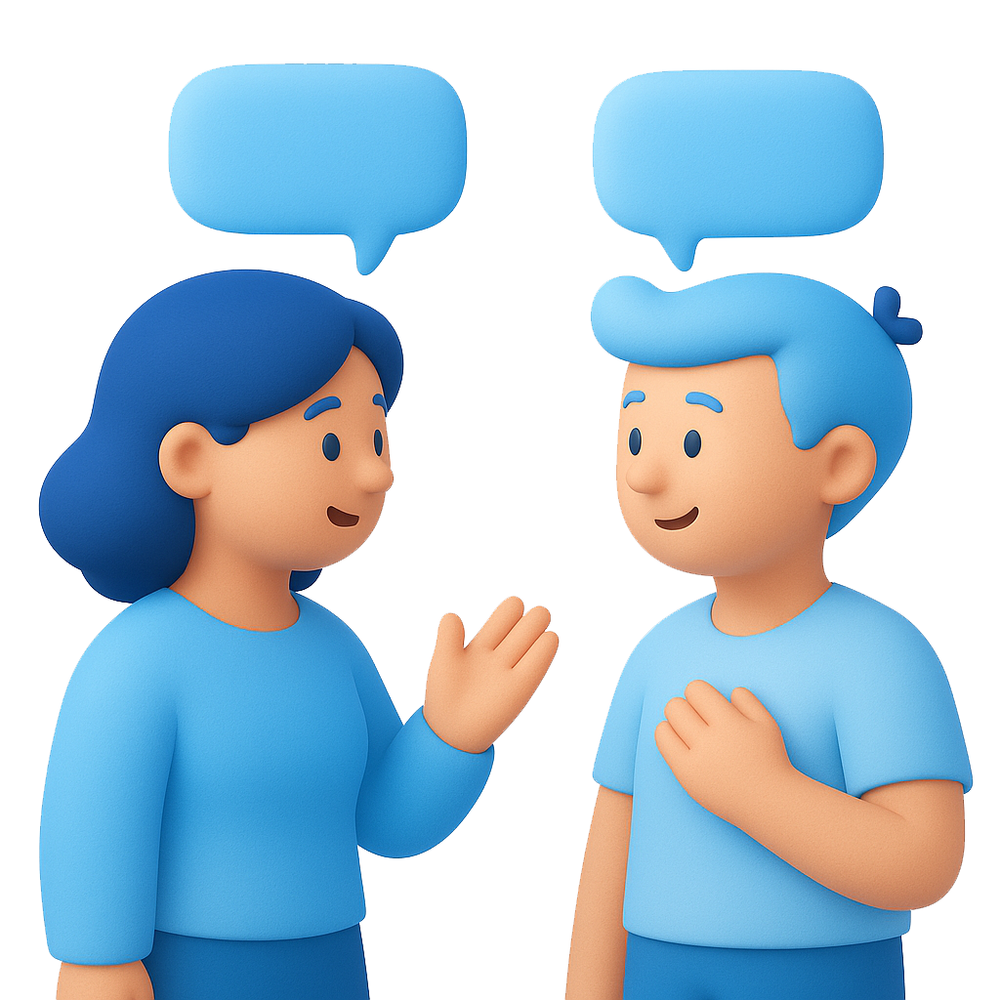
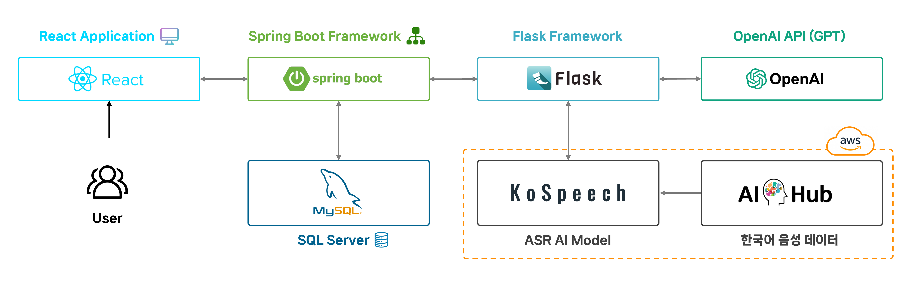
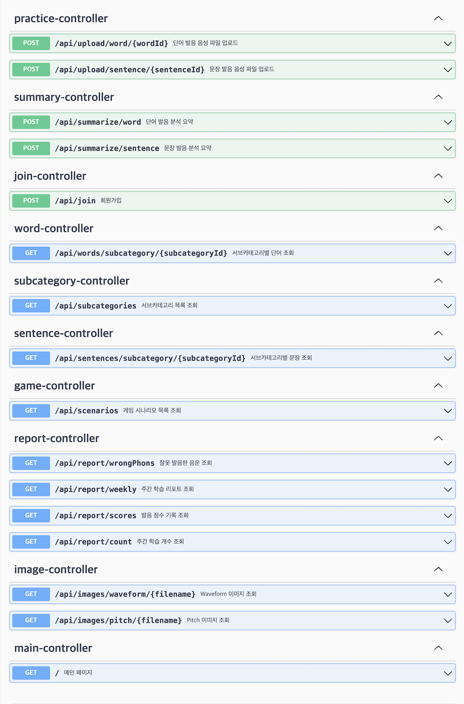
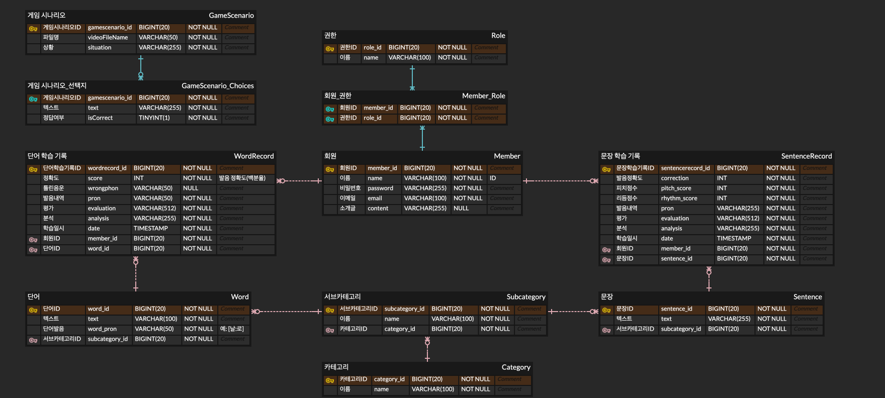

# 담설 💬
### 청각장애인을 위한 언어 학습 플랫폼, 담설(談說)
Damseol: A Language Learning Platform for the Hearing Impaired

<br>

## 팀 정보 🧑‍🤝‍🧑
<table align="center">
    <tr align="center">
        <td><a href="https://github.com/yhw032">
            <br/>
            <sub><b>윤희욱</b></sub></a>
            <br/> AI, Frontend
        </td>
        <td ><a href="https://github.com/cumoon">
            <br/>
            <sub><b>노문호</b></sub></a>  
            <br/> AI
        </td>
        <td><a href="https://github.com/modelable">
            <br/>
            <sub><b>이기정</b></sub></a>
            <br/> Backend
        </td>
        <td><a href="https://github.com/mllnxeo">
            <br/>
            <sub><b>조민서</b></sub></a>
            <br/> Frontend
        </td>
        <td><a href="https://github.com/sseung6">
            <br/>
            <sub><b>오승민</b></sub></a>
            <br/> Frontend
        </td>
    </tr>
</table>

<br>

## 프로젝트 정의 ✏️
``` 
이 프로젝트는 청각장애인을 위한 언어 학습 플랫폼으로, 학습자가 제공된 단어나 문장을 보고 녹음한 후
이를 분석하여 피드백을 제공하는 시스템을 구축하는 것을 목표로 한다.

학습자가 녹음을 진행하면, 수집된 음성 데이터는 DeepSpeech2 기반 음성 딥러닝 모델 KoSpeech2를 활용하여 텍스트로 변환된다.
이후, Python 기반 음성 분석 라이브러리 Librosa3를 사용하여 음정, 운율 등의 음향적 특징을 분석한다.

이 과정을 통해 얻은 데이터를 기반으로, 플랫폼은 시각적 피드백을 제공하며,
OpenAI의 GPT 모델을 활용하여 학습자의 발음에 대한 텍스트 기반 평가를 수행한다.
이를 통해 학습자는 제공된 다양한 시각적 정보로 피드백을 받을 수 있으며, 이를 바탕으로 발음을 교정할 수 있다.

이 플랫폼은 PC 환경의 웹 브라우저에서 사용할 수 있도록 개발되며,
직관적인 사용자 인터페이스(UI)를 통해 청각장애인 학습자가 쉽게 접근하고 활용할 수 있도록 설계하였다.
```

<br>

## 개발 기간 🗓️

2025.02.13. - 2025.05.30.

<br>

## 프로젝트 목표 ⛳

### 단어 학습

정상 청력을 가진 화자는 한국어의 발음 원리를 자연스럽게 습득하지만,
청각장애인은 이를 이해하는 데 어려움을 겪을 수 있다.

특히, 구개음화나 연음과 같은 음운 변동은 정상 청력자는 어릴 때부터 듣고 익히며 자연스럽게 체득하지만,
청각장애인에게는 낯선 개념이 될 수 있다. 

이에 따라, 이 프로젝트에서는 주요 음운 변동 유형을 중심으로 학습 카테고리를 구성하여,
청각장애인이 단어 발음을 보다 효과적으로 익힐 수 있도록 기획하였다.
그리고 특정 자음이나 모음에서만 발음상의 어려움을 겪을 가능성이 있으므로,
자음·모음 단위로도 학습을 분류하여 청각장애인에게 최적화된 학습 환경을 제공하고자 한다.

### 문장 학습

일상적인 대화는 대부분 문장 단위로 이루어지며, 
문장 발화에서는 발음의 정확성뿐만 아니라 음정, 운율, 성량 등의 요소도 중요한 역할을 한다.

이러한 요소들은 청각장애인이 발화할 때 겪는 주요한 어려움 중 하나이다.

따라서 이 프로젝트에서는 다양한 상황별 문장을 학습할 수 있도록 구성하고, 
발음 정확도뿐만 아니라 음정, 운율, 성량 등의 요소에 대한 피드백을 제공함으로써
더욱 청각장애인 친화적인 플랫폼을 구축하고자 한다.

### 학습 리포트
효과적인 언어 학습을 위해서는 꾸준한 훈련뿐만 아니라, 
자신의 학습 성과를 객관적으로 확인하고 향후 학습 계획을 수립하는 과정도 중요하다.

이에 따라, 학습 진행 과정에서 얻은 점수를 통계적으로 분석하고,
학습자의 발음 패턴 및 음성 데이터를 시각화하여 제공할 예정이다.
이를 통해 학습자가 자신의 발음 습관을 파악하고, 보다 체계적으로 언어 능력을 향상시킬 수 있도록 지원한다.

<br>

## 주요 기술 🛠️

### 시스템 아키텍쳐


### Tool 
```
- 개발 환경 : Windows, Mac OS
- 개발 도구 : Visual Studio Code, IntelliJ, MySQL workbench
- 개발 언어 : Javascript, Java, Python
- 주요 기술 : React, Spring Boot, Flask, GPT 4o
```

### Version

```
BackEnd
─ Java: OpenJDK 21
─ Spring Boot: 3.4.2
  ─ Gradle
  ─ Spring Data JPA
─ Database
  ─ MySQL
─ Security
  ─ Spring Security
  ─ JWT (JJWT 0.12.3)
─ API Docs
  ─ SpringDoc OpenAPI 2.2.0
─ DevTools & 기타
  ─ Spring Boot DevTools
  ─ Lombok
  ─ Actuator
  ─ JUnit + Spring Security Test

FrontEnd
─ React: 19.0.0 (CRA 기반)
─ Router: React Router DOM 7.1.5
─ HTTP 통신: Axios
─ 차트 시각화: Chart.js + react-chartjs-2
─ 애니메이션: Framer Motion
─ 아이콘: React Icons
─ 테스트
  ─ Testing Library (React, DOM, UserEvent, Jest DOM)
─ 환경 설정
  ─ ESLint: CRA 기본 설정
  ─ Browserslist: 최신 브라우저 대응

AI
─ Python: ≤ 3.12.x
─ PyTorch: ≥ 1.4.0
─ Torchaudio, Librosa: 오디오 처리
─ Numpy, Pandas: 데이터 처리
─ TQDM: 진행률 표시
─ Matplotlib, Astropy: 시각화 및 분석
─ SentencePiece: 토크나이저
─ Hydra-Core: 설정 관리
─ python-Levenshtein: 유사도 측정
```

### API


### ERD

