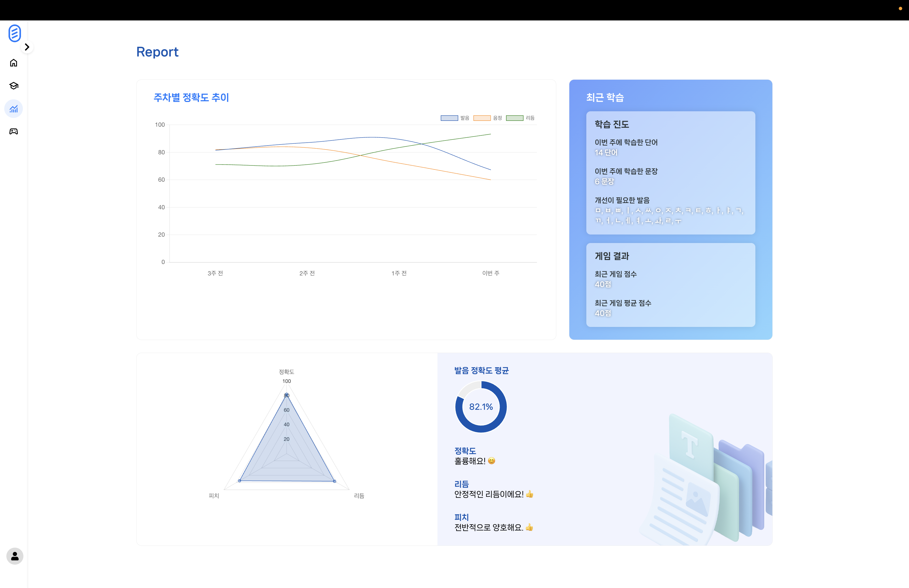
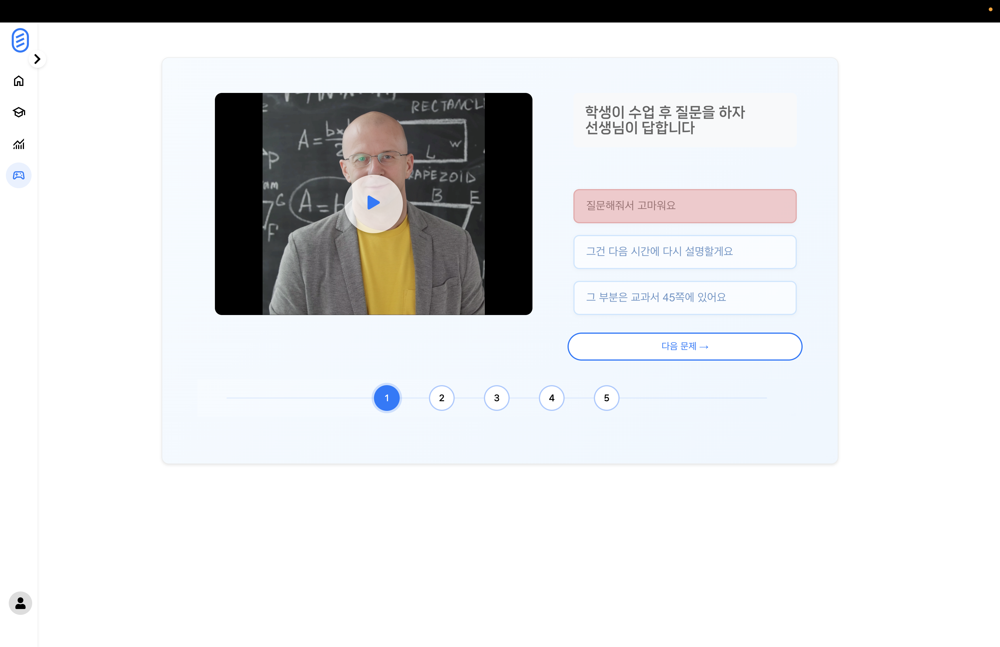

 # 담설 💬
### 청각장애인을 위한 언어 학습 플랫폼, 담설(談說)
Damseol: A Language Learning Platform for the Hearing Impaired

<div style="display: flex; gap: 10px;">
  
  
</div>
시연 URL: https://www.youtube.com/watch?v=0ooLWTzr20A

<br><br>

## 팀 정보 🧑‍🤝‍🧑
<table align="center">
    <tr align="center">
        <td><a href="https://github.com/yhw032">
            <br/>
            <sub><b>윤희욱</b></sub></a>
            <br/> AI, Frontend
        </td>
        <td ><a href="https://github.com/cumoon">
            <br/>
            <sub><b>노문호</b></sub></a>  
            <br/> AI, Backend
        </td>
        <td><a href="https://github.com/modelable">
            <br/>
            <sub><b>이기정</b></sub></a>
            <br/> Backend
        </td>
        <td><a href="https://github.com/mllnxeo">
            <br/>
            <sub><b>조민서</b></sub></a>
            <br/> Frontend
        </td>
        <td><a href="https://github.com/sseung6">
            <br/>
            <sub><b>오승민</b></sub></a>
            <br/> Frontend
        </td>
    </tr>
</table>

<br>

## 주요 기술 🛠️

### 시스템 아키텍쳐


### Tool 
```
- 개발 환경 : Windows, Mac OS
- 개발 도구 : Visual Studio Code, IntelliJ, MySQL
- 개발 언어 : Javascript, Java, Python
- 주요 기술: React, Spring Boot, Flask, OpenAI, KoSpeech
```

### Version

```
BackEnd
─ Java: OpenJDK 21
─ Spring Boot: 3.4.2
  ─ Gradle
  ─ Spring Data JPA
─ Database
  ─ MySQL
─ Security
  ─ Spring Security
  ─ JWT (JJWT 0.12.3)
─ API Docs
  ─ SpringDoc OpenAPI 2.2.0
─ DevTools & 기타
  ─ Spring Boot DevTools
  ─ Lombok
  ─ Actuator
  ─ JUnit + Spring Security Test

FrontEnd
─ React: 19.0.0 (CRA 기반)
─ Router: React Router DOM 7.1.5
─ HTTP 통신: Axios
─ 차트 시각화: Chart.js + react-chartjs-2
─ 아이콘: React Icons, Material Symbols & Icons
─ 테스트
  ─ Testing Library (React, DOM, UserEvent, Jest DOM)
─ 환경 설정
  ─ ESLint: CRA 기본 설정
  ─ Browserslist: 최신 브라우저 대응

AI
─ Python: ≤ 3.12.x
─ PyTorch: ≥ 1.4.0
─ Torchaudio, Librosa: 오디오 처리
─ Numpy, Pandas: 데이터 처리
─ TQDM: 진행률 표시
─ Matplotlib, Astropy: 시각화 및 분석
─ SentencePiece: 토크나이저
─ Hydra-Core: 설정 관리
─ python-Levenshtein: 유사도 측정
```

### API


<br>

### ERD


<br>

## 개발 기간 🗓️

2025.02.13. - 2025.05.30.

<br>

## 프로젝트 배경 ⛰️
``` 
일반적인 화자는 타인의 말을 듣고 발화를 모방하면서 자연스럽게 음운 규칙과 화용적 요소를 체득하지만,
청각장애인은 이러한 경로가 제한된다. 특히 선천성 청각장애 아동의 경우, 제한된 청각 경험과 우연 학습의 부재로 인해
언어 발달이 지연될 수 있으며, 후천적 청력 손실이 있는 성인의 경우에도 다양한 음성 매개변수에서 왜곡이 발생할 수 있다.

연구에 따르면, 청각장애인의 발화는 비장애인과 비교할 때 기본 주파수, 음성 강도, 주파수/진폭 변동률 등에서 뚜렷한 차이를 보인다.
이는 청각 피드백 부족으로 인해 자신의 음성을 조절하는 능력이 제한되기 때문이다.

최근에는 전자기 조음 측정기(Electromagnetic Articulography, EMA) 등 시각 기반 훈련 도구를 활용한 연구에서
청각장애인의 발음 정확도 향상 가능성이 확인되었으며, 이는 시각적 피드백의 효과성을 뒷받침하는 근거가 된다.

기존 언어 학습 플랫폼은 대부분 음성 콘텐츠에 의존하고 있으며, 청각장애인을 위한 구조적 배려가 부족한 경우가 많다.
청각장애인은 단순한 발음 정확성뿐만 아니라, 음정, 음량, 운율 등 다차원적 피드백이 필요한 학습자임에도 불구하고,
현재까지 이를 체계적으로 제공하는 플랫폼은 거의 없는 실정이다.
```
<br>

## 프로젝트 정의 ✏️
``` 
이 프로젝트는 청각장애인을 위한 언어 학습 플랫폼으로, 학습자가 제공된 단어나 문장을 보고 녹음한 후
이를 분석하여 피드백을 제공하는 시스템을 구축하는 것을 목표로 한다.

학습자가 녹음을 진행하면, 수집된 음성 데이터는 DeepSpeech2 기반 음성 딥러닝 모델 KoSpeech2를 활용하여 텍스트로 변환된다.
이후, Python 기반 음성 분석 라이브러리 Librosa3를 사용하여 음정, 운율 등의 음향적 특징을 분석한다.

이 과정을 통해 얻은 데이터를 기반으로, 플랫폼은 시각적 피드백을 제공하며,
OpenAI의 GPT 모델을 활용하여 학습자의 발음에 대한 텍스트 기반 평가를 수행한다.
이를 통해 학습자는 제공된 다양한 시각적 정보로 피드백을 받을 수 있으며, 이를 바탕으로 발음을 교정할 수 있다.
```
<br>


<!--
## 프로젝트 목표 ⛳

### 단어 학습
<div style="display: flex; gap: 10px;">
  
  
</div>
자음, 모음, 음절의 끝소리 등 한국어 발음 규칙에 따라 구성된 카테고리에서 단어 연습을 선택할 수 있다.
사용자는 마이크 버튼을 눌러 자신의 발음을 녹음하며 단어 학습을 수행한다.
녹음한 발음에 대한 정확도, 추천 학습 음소, 사용자 발음 비교 등을 시각적으로 확인할 수 있다.

### 문장 학습
<div style="display: flex; gap: 10px;">
  
  
</div>
일상생활의 다양한 상황(예: 식당, 교회 등), 문법 요소별(예: 문장 내 불규칙 활용)에 맞추어 구성된 카테고리에서 문장 연습을 선택할 수 있다.
사용자는 Waveform, Pitch, 정확도, 발음 평가 등의 학습 결과를 다양한 시각 자료로 확인할 수 있다.

### 학습 결과
<div style="display: flex; gap: 10px;">
  
  
</div>
단어 학습이 종료되면 사용자가 특별히 틀리는 자/모음 등을 표시하고 발음 팁을 제공하는 화면이다.
결과 요약 화면에서는 사용자의 발음 정확도, 피치, 리듬, 학습 팁을 종합적으로 보여준다.

### 학습 리포트
<div style="display: flex; gap: 10px;">
  
</div>
주차별 발음 정확도, 음정, 리듬 점수 및 학습 진도, 게임 결과를 종합적으로 확인할 수 있는 통계 페이지이다.

### 구화(口和) 학습 게임
<div style="display: flex; gap: 10px;">
  
  
</div>
입모양만 보고 발음을 추측하는 훈련을 통해 구화 능력을 향상시키는 게임 학습 화면이다.
사용자는 영상에 표시되는 사람의 입모양을 보고 정답 선택지를 고르게 된다.
-->
<br>
